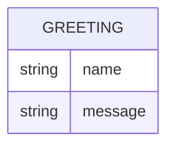

# Domain Model

Greeter is stateless and persists nothing; the single entity below is the shape of its response, not a stored record.

`Greeting` is computed per request from the `name` query parameter and is never stored.